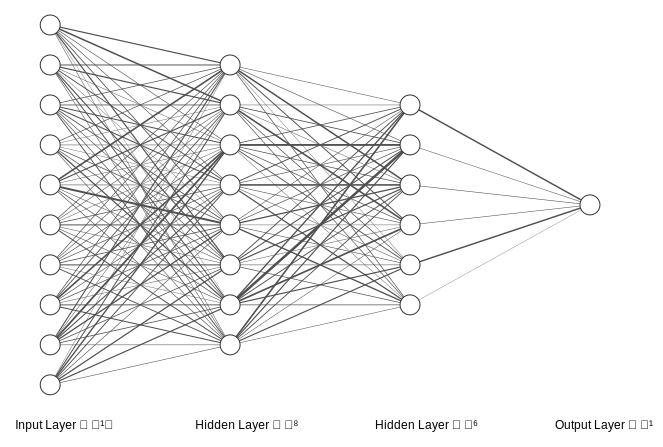

# NN-Visualizer

**▶ Run it live: [https://mzelbash.github.io/NN-Visualizer/](https://mzelbash.github.io/NN-Visualizer/)**

NN-Visualizer is an interactive teaching tool for fully-connected neural networks (FCNNs). It lets students *see* what happens inside a network: every weight is drawn, every neuron can be opened up, and a live forward pass runs through the whole diagram as you change inputs, weights, or activation functions.

## Features

- **Parametric network builder** : set any number of layers and neurons per layer, with full control over spacing, colors, node size, orientation, and layout.
- **Seeded weight initialization** : choose Xavier/Glorot, He, Normal(0, 0.5), or Uniform(−1, 1), with a numeric seed. The same seed always reproduces exactly the same weights and biases, so classroom examples are repeatable.
- **Weights you can see** :  edge thickness is proportional to |w|, sign can be color-coded (positive vs. negative, with a legend), hovering any edge shows its exact value, and numeric weight labels can be toggled on for all edges.
- **Clickable neurons** : clicking any neuron opens a detail panel showing its incoming weights, the fully written-out weighted sum *z = w₁·x₁ + w₂·x₂ + … + b* with the actual numbers, the activation output *a = f(z)*, and a plot of the activation curve with the point (z, a) marked.
- **Per-layer activation functions** :  ReLU, Leaky ReLU, Sigmoid, Tanh, or Linear, switchable from any neuron's panel; the output layer additionally offers Softmax.
- **Editable inputs & live forward pass** : click an input neuron to change its value; all downstream z and a values update immediately.
- **SVG export** :  download the current diagram as a clean, publication-ready SVG file.
- **Fully static** :  no build step and no server. Open `index.html` straight from the filesystem, or host the folder on any static host such as GitHub Pages.

## Running locally

Clone the repository and open `index.html` in a browser. Really, that is all it takes. (An internet connection is needed for the CDN-hosted libraries: d3, Bootstrap, and jQuery.)

## License

MIT.

## Citation

If you use NN-Visualizer, please cite:

> Elbasheer, Mohamed (2026). NN-Visualizer: An Interactive Teaching Tool for Fully-Connected Neural Networks. GitHub repository, github.com/mzelbash/NN-Visualizer.

NN-Visualizer is a modified version of the open-source NN-SVG project (MIT license), which should also be credited:

> LeNail, Alexander (2019). NN-SVG: Publication-Ready Neural Network Architecture Schematics. Journal of Open Source Software, 4(33), 747, doi:10.21105/joss.00747.
